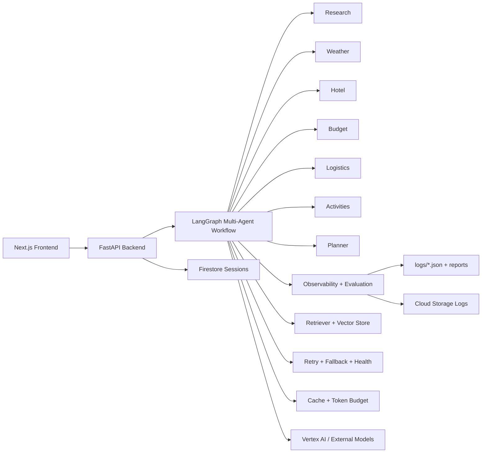

# Trip-Book Production Upgrade

Trip-Book is now structured as a production-grade multi-agent AI workflow system built around LangGraph, FastAPI, and a monitoring/evaluation layer designed for enterprise-style AI engineering.

## What Changed

- Per-agent observability with latency, retry, success, token, and cost tracking
- Evaluation framework with completeness, faithfulness, relevance, hallucination, and retrieval-precision metrics
- Semantic retrieval layer with embeddings, vector storage, top-k retrieval, and context injection
- Reliability layer with retry, degraded-mode handling, fallback model hooks, and health monitoring
- Reusable typed agent components for planner, hotel, budget, and itinerary generation
- Experiment runner, benchmark dataset, and CSV/JSON reporting
- Streamlit monitoring dashboard for logs and cost trends
- GCP deployment scaffolding for Cloud Run, Cloud Storage, Firestore, and Vertex AI
- Cost controls for caching and token budget management

## Architecture



## Updated Structure

```text
backend/app/
  agents/
    base.py
    planner_agent.py
    budget_agent.py
    hotel_agent.py
    itinerary_agent.py
  core/
    config.py
  evaluation/
    evaluator.py
    metrics.py
    report_generator.py
  graph/
    graph.py
    instrumentation.py
    state.py
  optimization/
    cache.py
    token_budget.py
  resilience/
    retry.py
    fallback.py
    health_monitor.py
  retriever/
    embedder.py
    vector_store.py
    retriever.py
  observability.py
  services.py
dashboard/
  app.py
  charts.py
deployment/
  Dockerfile
  cloudbuild.yaml
  terraform/main.tf
docs/
  architecture.md
  evaluation.md
  deployment.md
  user_guide.md
experiments/
  dataset.json
  experiment_runner.py
  evaluation_pipeline.py
logs/
  runs.json
  latency.json
  costs.json
```

## Workflow

The runtime flow stays compatible with the existing planner:

1. `POST /plan` creates a `run_id` and initializes typed workflow state.
2. Each LangGraph node is wrapped with instrumentation, retry, caching, and optional retrieval augmentation.
3. Metrics are accumulated at the agent level and written to structured logs.
4. Each completed run produces JSON, Markdown, and CSV evaluation artifacts.
5. The API returns the generated plan plus degradation and agent-metric metadata.

## Setup

### Backend

```bash
cd backend
pip install -r requirements.txt
uvicorn app.api.main:app --reload
```

### Frontend

```bash
cd frontend
npm install
npm run dev
```

### Monitoring

```bash
streamlit run dashboard/app.py
```

### Experiments

```bash
python experiments/experiment_runner.py
python experiments/evaluation_pipeline.py
```

## Evaluation

Tracked metrics include:

- Response latency per agent
- Token usage and estimated cost
- Success/failure rate
- Retry count
- Output completeness
- Faithfulness
- Relevance
- Hallucination score
- Retrieval precision

Evaluation outputs are generated automatically under `logs/` and `logs/reports/`.

## Deployment

Production deployment assets are included for:

- Cloud Run service packaging
- Cloud Build image build and rollout
- Terraform provisioning for Cloud Run, Cloud Storage, and Firestore

See [docs/deployment.md](/Users/sumanthvarma/Downloads/Travel-Book-master/docs/deployment.md) for rollout guidance.

## Benchmarks

The repository now includes a starter benchmark dataset and experiment summary pipeline. The current scoring layer is intentionally lightweight and heuristic-based so the system remains runnable locally while leaving clean upgrade points for model-based judges and full offline evaluation later.
