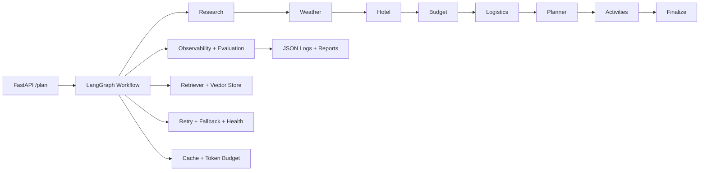

# Architecture

The production upgrade keeps the existing LangGraph sequence but wraps each node with shared enterprise controls:

- Observability: per-agent metrics, cost estimation, retry counts, and structured logs
- Retrieval: semantic context injection before node execution
- Resilience: retry with exponential backoff and degraded-mode signaling
- Optimization: caching and token budget enforcement
- Reporting: per-run JSON, Markdown, and CSV artifacts

